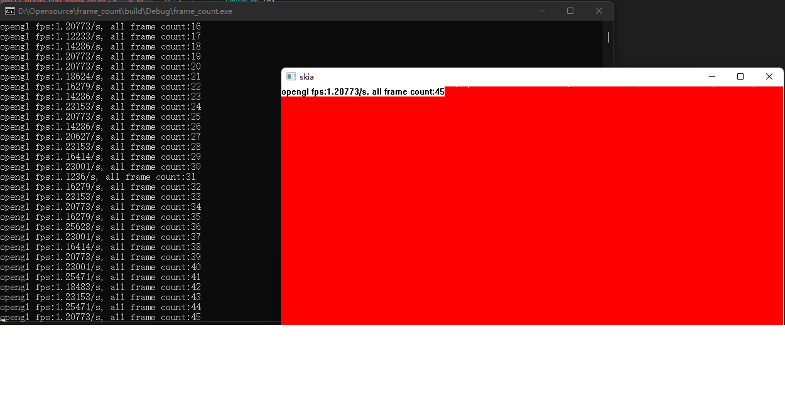

# frame count

to use this program you would first correct the cmakelist.txt

to change the boost file locate 

>include_directories
>link_directories

use the api hook the gdi or opengl api to count the frame

the module hook has any problem, i want hook the special module but i can not the function return type and the parameter may be not correct. it would be pleasure for you pull request.

to start this program, just run

> frame_count  test.exe(full path application to get the frame count)

